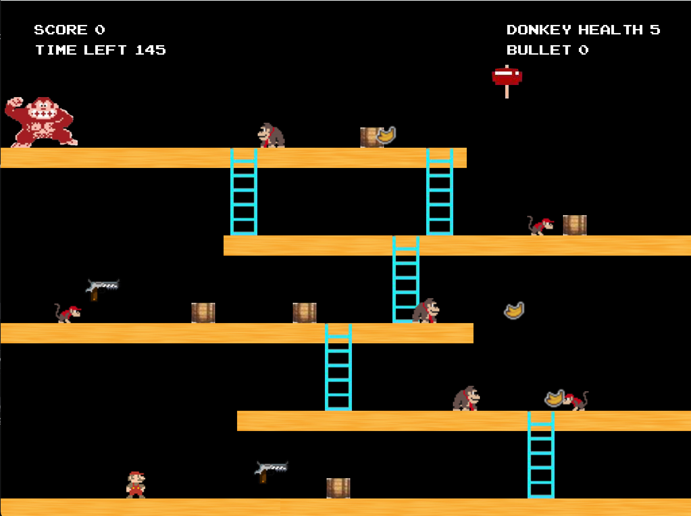
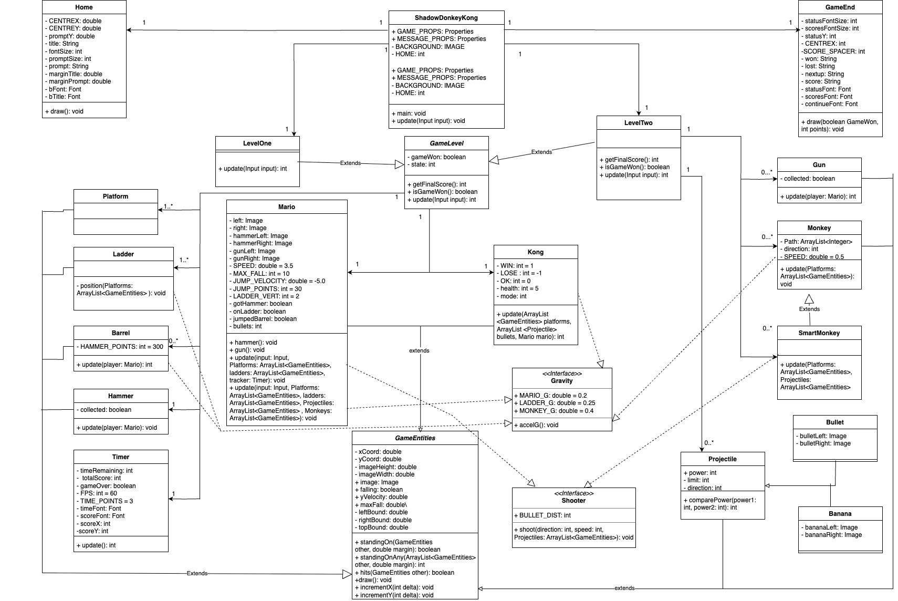

# Shadow DonkeyKong

Game implemented in Java using the Bagel graphics engine.
It designed with Object-Oriented style, implementing gravity and collision for the game entities.

## Aim:
Defeat donkeykong with 1 hit of the hammer or 3 shots of the gun.
Collect points by jumping over barrels, destroying barrels, or hitting monkeys.
Avoid the bananas and barrels!

### Controls:

<kbd>◀️</kbd><kbd>▶️</kbd> - Move Left / Move Right

<kbd>🔼</kbd><kbd>🔽</kbd> - Up Ladder / Down Ladder

<kbd>Space</kbd> - Jump

<kbd>S</kbd> - Shoot Gun

## Setup instructions:

Clone Repo and install any dependencies

Run on Java 17

## Acknowledgement

Builds upon the source code provided for SWEN20003 after completion of Assignment 1 ( Level 1)
